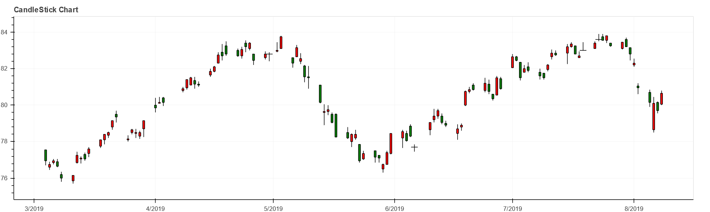
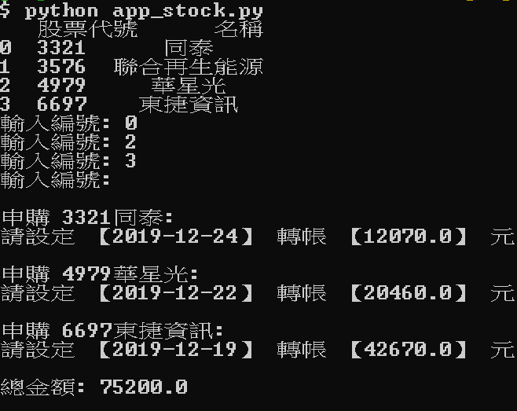

# Finance

財經相關的程式碼筆記

## 0050 K線圖

* 利用 bokeh 製作網頁互動式K線圖

呈現結果截圖:

## stock_public.py

* 列出: 目前可申購 & 價差>10% 的股票代號與名稱
* Input: 使用者輸入欲抽的股票
* Output: 申購 XXXX股票: 請設定【日期】轉帳【金額】元
* 同時將 output 存入以當日日期為名稱的 txt 檔，做為紀錄

